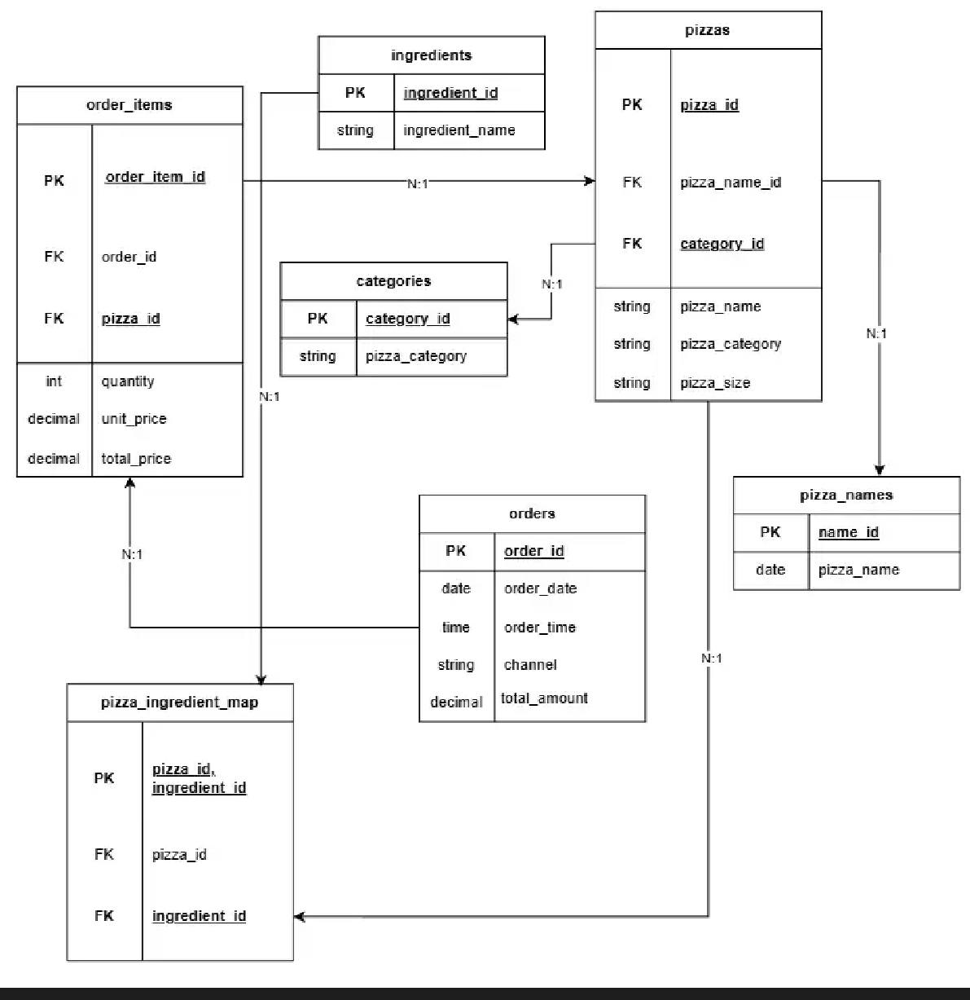

# Technical Report: AI-Powered Pizza Database Query Assistant

## Abstract

This project develops an intelligent database query system that enables natural language interaction with a pizza database. The system combines a normalized relational database implemented in MySQL with an AI-powered natural language interface built using LangChain and Google's Gemini Flash model. Users can ask questions about orders, pizzas, ingredients, and sales patterns in plain English, which are automatically translated into SQL queries and executed against the database. The dataset consists of synthetically generated data including pizzas, orders and ingredients, designed to simulate unrealistic non-business antioperations.

## Problem & Dataset


In a shocking revelation, market research has identified a critical gap: the complete absence of solutions for querying self-populated pizza databases filled with random data. This project addresses this previously overlooked market need.

## Database Design

The database follows a normalized relational design adhering to Third Normal Form (3NF) to eliminate data redundancy and ensure data integrity. The schema consists of seven core tables with well-defined relationships:

- **Pizza** and **Category** tables manage product information with a one-to-many relationship
- **Ingredient** and **Pizza_Ingredient** tables implement a many-to-many relationship for flexible recipe management
- **Ord** (orders) table captures transaction metadata including timestamps and delivery channels
- **Ord_Item** serves as a junction table linking orders to pizzas with quantity information

The initial Entity-Relationship diagram (shown in `images/db_struct.png`) conceptualized these relationships. The final implementation `sql/setup_db_structure.sql` includes refinements such as more appropriate and safe foreign key constraints.



## Implementation

The database was implemented in MySQL with DDL script (`sql/setup_db_structure.sql`). Data population was automated via `populate_db.py` to ensure consistency.

Three analytical views simplify common queries:

1. **Full Order Details View:** Combines order, order item, and pizza information for comprehensive order analysis
2. **Pizza Category Summary View:** Aggregates pizza count by category
3. **Pizza Popularity View:** Ranks pizzas by order frequency

These views encapsulate complex joins, making frequently-needed information readily accessible to both users and the AI agent.

## Optimization

Performance optimization focused on indexing strategy to accelerate common query patterns:
```sql
CREATE INDEX idx_pizza_category ON pizza(category_id);
CREATE INDEX idx_item_pizza ON item(pizza_id);
CREATE INDEX idx_pizza_ingredient ON pizza_ingredient(ingredient_id);
CREATE INDEX idx_ord_time ON ord(order_time);
CREATE INDEX idx_ord_channel ON ord(channel);
CREATE INDEX idx_orditem_ord ON ord_item(ord_id);
```

## AI Integration

The natural language interface leverages LangChain's SQL agent framework integrated with Google's Gemini Flash model. The workflow operates as follows:

1. **User Input:** Natural language question submitted through the interface
2. **Schema Understanding:** The AI agent receives database schema information to understand available tables and relationships
3. **SQL Generation:** Gemini translates the natural language query into syntactically correct SQL
4. **Query Execution:** Generated SQL runs against the MySQL database
5. **Result Interpretation:** Raw query results are processed and formatted by the AI into human-readable responses

LangChain provides the orchestration layer, managing the conversation context, error handling, and iterative refinement when initial queries fail. The system includes safeguards to prevent destructive operations (DROP, DELETE) and limits query complexity to ensure security and performance.

## Results

The AI-powered query system successfully handles a variety of natural language questions with varying degrees of accuracy. It reliably processes straightforward queries such as "How many pizzas do we offer?" or "What are our most popular pizzas?" which translate directly to simple SELECT statements with aggregations.

## Conclusion

This project successfully demonstrates the feasibility of combining traditional relational databases with modern AI language models to create accessible data analysis tools. The system achieves its primary goal of enabling non-technical users to query restaurant data through natural language, though with accuracy trade-offs compared to direct SQL.

**Key Achievements:**
- Designed and implemented a normalized relational database following best practices
- Created an AI-powered natural language interface reducing technical barriers
- Demonstrated practical business intelligence applications for restaurant analytics

**Future Improvements:**
- **Enhanced AI Accuracy:** Fine-tuning the model on domain-specific queries or implementing feedback loops to learn from corrections
- **Expanded Dataset:** Incorporating real-world data patterns, seasonal variations, and customer demographics
- **Advanced Analytics:** Adding support for predictive queries, what-if scenarios, and recommendation systems
- **Multi-turn Conversations:** Enabling context-aware follow-up questions for deeper analysis

The project establishes a foundation for intelligent database interfaces that can evolve with continued development and training.